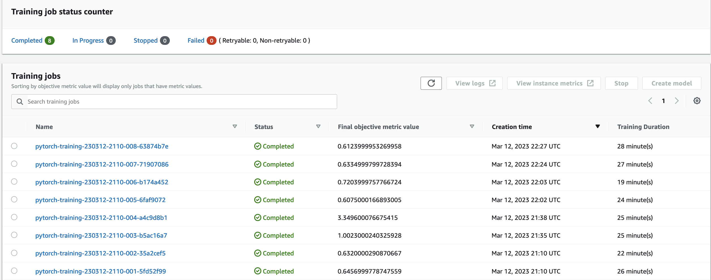
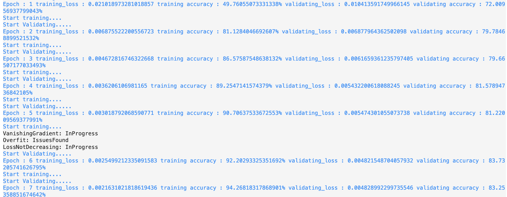

# Image Classification using AWS SageMaker

Use AWS Sagemaker to train a pretrained model that can perform image classification by using the Sagemaker profiling, debugger, hyperparameter tuning and other good ML engineering practices. This can be done on either the provided dog breed classication data set or one of your choice.

## Project Set Up and Installation

Enter AWS through the gateway in the course and open SageMaker Studio. 
Download the starter files.
Download/Make the dataset available. 

## Dataset

The provided dataset is the dogbreed classification dataset which can be found in the classroom.
The project is designed to be dataset independent so if there is a dataset that is more interesting or relevant to your work, you are welcome to use it to complete the project.

### Access

Upload the data to an S3 bucket through the AWS Gateway so that SageMaker has access to the data. 

## Code Files

- `train_and_deploy.ipynb` 
    1. Steps to upload dog images to S3 bucket
    2. Running training job with hyperparameters and get best model from hyperparameter training
    3. Train the bestperformance model, test it and make sagemaker profiling & debugger
    4. Deploy the model to "ml.m5.xlarge" instance and make an inference.
    5. Delete the endpoint after testing.

- `hpo.py` This is the python script using to train and test all models in tuning hyperparameters step.

- `train.py` This is the python script using to train the best performance model and test it.

- `inference` This script we use it to deploy the model on AWS and make prediction.

## Hyperparameter Tuning

- The Resnet50 used to learn the data because it is trained on a lot of data and it's concolution can get the general feature 
- One fully connected layer is used on top of resnet50 to predict 133 number of dog breed
- Batch- size, Epochs, and Learning rate are used to search for the best model in  the tunning hyperparameters step
     - batch size : [32,64,128,256,512]
     - epochs : (6,8)
     - lr : (0.001,0.1)
- Hyperparameters from best model with least loss are used for training the Resnet50 model "epochs": 7, "batch-size": 128, "lr": 0.0011326071316402377

## Hypertuning Main Job

## Completed Hypertuning Training Jobs

## Best model metric from Hypertuning Jobs

## Training Job with selected Hyperparameters

## Log for Training Job with selected Hyperparameters

## Debugging and Profiling

### Profiling Config
- SageMaker Debugger collects system and framework profiling information of training jobs and identify performance bottlenecks.
- Configuration for collecting system and framework metrics of SageMaker training jobs can be set with ProfilerConfig class. 
- For the training job, following Profiler config is used
    1. System monitoring was set to 500 millis
    2. The number of steps to profile set to 10

### Profiler Output/Result

The profiler report can be found [here](ProfilerReport/profiler-report.html).
- During the training job, the Dataloader rule was the most frequently triggered. It processed 11 datapoints and was triggered 1 times. 

### Debugging Hook Config
- Configuration information for the Amazon SageMaker Debugger output
- include_regex:CrossEntropyLoss_output_0- It determines if the training or validation loss is decreasing and raises an issue if the loss has not decreased by a certain percentage in the last few iterations.

### Debugger Output/Result
#### The Graphical representation of the Cross Entropy Loss.

#### The Graphical representation issue reported due to no loss in epochs.

## Model Deployment

- Model was deployed to a "ml.m5.xlarge" instance type and "endpoint_inference.py" script is used to setup and deploy our working endpoint.
- For testing purposes few test images are stored in the "images" folder.
- image are fed to the endpoint for inference.

### Model Endpoint

### Inference Result

- From Validation Set:
    1. Model identified the label for Basenji dog breed correctly.
    2. Label 11 (Beagle) was identified incorrectly as label 7 (American Foxhound).
    3. Label 31 (Borzoi) was identified incorrectly as label 94 (Komondor)
- From Test Set:
    1. Model identified the label 39 for Bull Terrier dog breed correctly.
