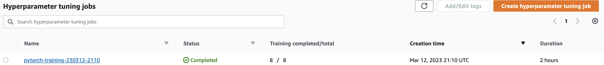
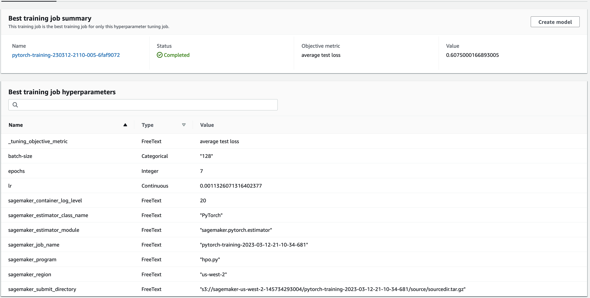
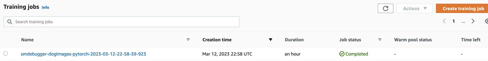
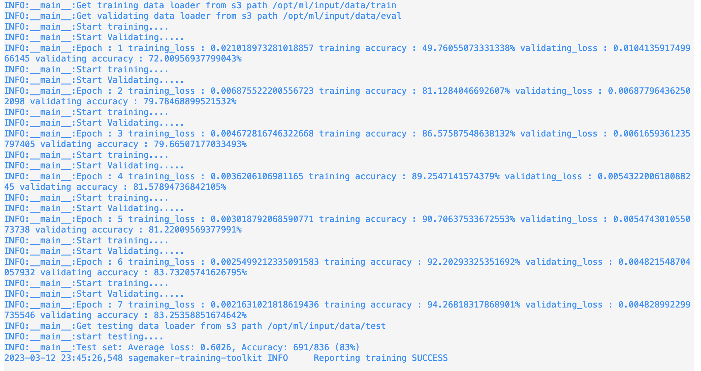
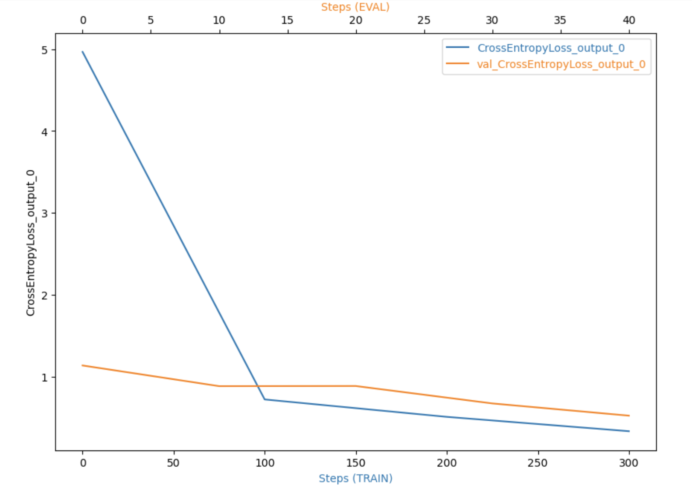
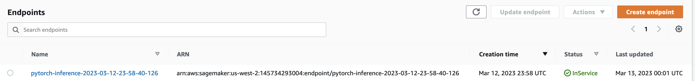

# Image Classification using AWS SageMaker

Use AWS Sagemaker to train a pretrained model that can perform image classification by using the Sagemaker profiling, debugger, hyperparameter tuning and other good ML engineering practices. This can be done on either the provided dog breed classication data set or one of your choice.

## Project Set Up and Installation
Enter AWS through the gateway in the course and open SageMaker Studio. 
Download the starter files.
Download/Make the dataset available. 

## Dataset
The provided dataset is the dogbreed classification dataset which can be found in the classroom.
The project is designed to be dataset independent so if there is a dataset that is more interesting or relevant to your work, you are welcome to use it to complete the project.

### Access
Upload the data to an S3 bucket through the AWS Gateway so that SageMaker has access to the data. 

## Code Files
- `train_and_deploy.ipynb` 
    1. Steps to upload dog images to S3 bucket
    2. Running training job with hyperparameters and get best model from hyperparameter training
    3. Train the bestperformance model, test it and make sagemaker profiling & debugger
    4. Deploy the model to "ml.m5.xlarge" instance and make an inference.
    5. Delete the endpoint after testing.

- `hpo.py` This is the python script using to train and test all models in tuning hyperparameters step.

- `train.py` This is the python script using to train the best performance model and test it.

- `inference` This script we use it to deploy the model on AWS and make prediction.

## Hyperparameter Tuning

- The Resnet50 used to learn the data because it is trained on a lot of data and it's concolution can get the general feature 
- One fully connected layer is used on top of resnet50 to predict 133 number of dog breed
- Batch- size, Epochs, and Learning rate are used to search for the best model in  the tunning hyperparameters step
     - batch size : [32,64,128,256,512]
     - epochs : (6,8)
     - lr : (0.001,0.1)
- Hyperparameters from best model with least loss are used for training the Resnet50 model "epochs": 7, "batch-size": 128, "lr": 0.0011326071316402377
## Hypertuning Main Job

## Debugging and Profiling
**TODO**: Give an overview of how you performed model debugging and profiling in Sagemaker
### Debugger Output
The Graphical representation of the Cross Entropy Loss.

### Profiler Output
The profiler report can be found [here](ProfilerReport/profiler-report.html).

### Results
**TODO**: What are the results/insights did you get by profiling/debugging your model?

**TODO** Remember to provide the profiler html/pdf file in your submission.

## Model Deployment
**TODO**: Give an overview of the deployed model and instructions on how to query the endpoint with a sample input.

**TODO** Remember to provide a screenshot of the deployed active endpoint in Sagemaker.
- Model was deployed to a "ml.m5.large" instance type and "endpoint_inference.py" script is used to setup and deploy our working endpoint.
- For testing purposes ,one test images are stored in the "images" folder.
- image are fed to the endpoint for inference.
### Model Endpoint

